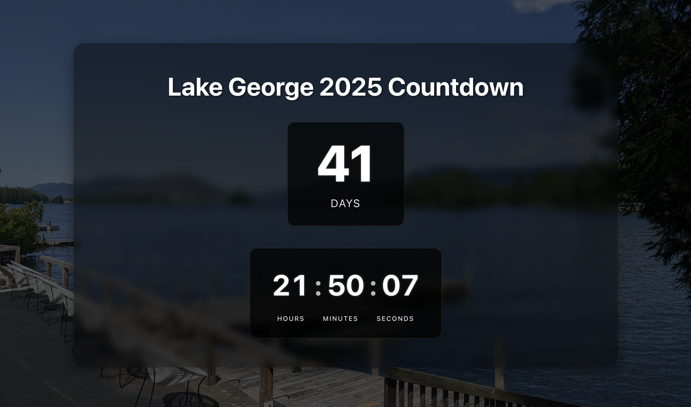

# Countdown UI

A React-based countdown timer interface built with Vite. Display a beautiful countdown to any target date with days, hours, minutes, and seconds.



## Features

- Clean, modern UI design
- Configurable target date
- Real-time updates
- Responsive layout
- Dark theme with subtle animations
- Containerized deployment support

## Prerequisites

- Node.js 18 or higher
- npm 9 or higher
- Docker or Podman (optional, for containerized deployment)

## Local Development

1. Install dependencies:
```bash
npm install
```

2. Start the development server:
```bash
npm run dev
```

The application will be available at http://localhost:5173 with hot module replacement (HMR) enabled.

## Testing

Run the test suite:
```bash
npm run test
```

Or in watch mode during development:
```bash
npm run test:watch
```

## Container Deployment

You can use either Docker or Podman for container deployment. The commands are interchangeable - simply replace `docker` with `podman` if using Podman.

1. Build the container image:
```bash
# Using Docker
docker build -t countdown-ui .

# Using Podman
podman build -t countdown-ui .
```

2. Run the container:
```bash
# Using Docker
docker run -p 3000:80 countdown-ui

# Using Podman
podman run -p 3000:80 countdown-ui
```

The application will be available at http://localhost:3000.

## Configuration

Edit `src/config/countdown.config.js` to set your target date and countdown title:

```javascript
export const targetDate = '2025-06-28T00:00:00-05:00'
export const countdownTitle = 'Your Event Title'
```

## Available Scripts

- `npm run dev` - Start development server
- `npm run build` - Build for production
- `npm run lint` - Run ESLint
- `npm run preview` - Preview production build locally
- `npm run test` - Run test suite
- `npm run test:watch` - Run test suite in watch mode
